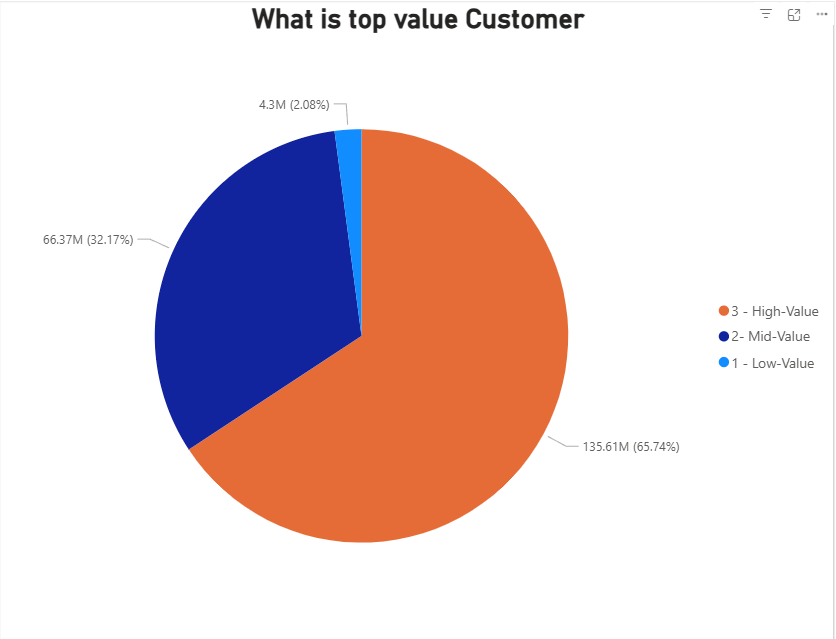
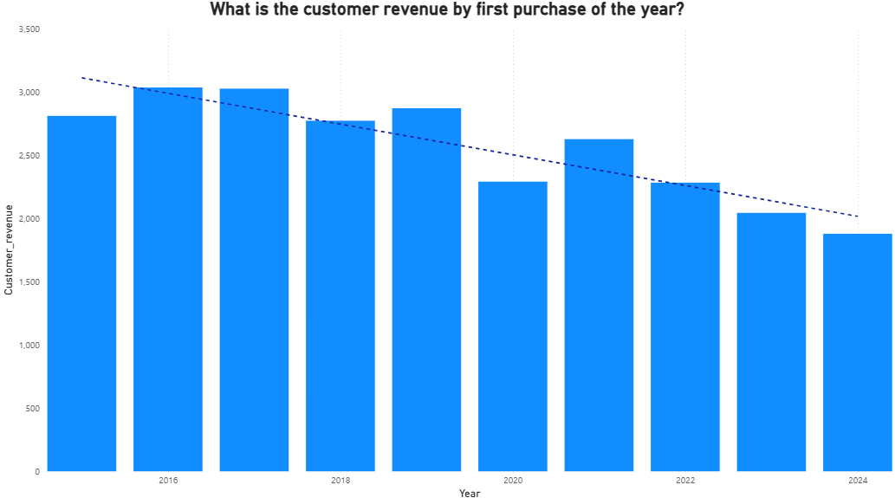
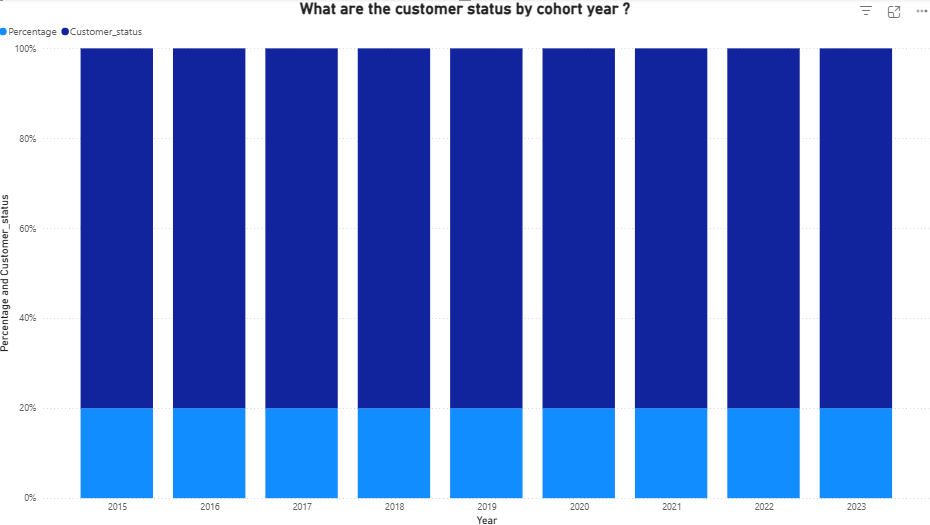

# SQL - Sales Analysis

## Overview
As part of my data analytics projects, I conducted a comprehensive analysis of customer behavior, retention, and lifetime value (CLV) for an e-commerce company. The goal was to identify actionable insights to improve customer retention and maximize long-term revenue.

## Business Questions
1. **Customer Segmentation:** Who are our most valuable customers?
2. **Cohort Analysis:** How do different customer groups generate revenue?
3. **Retention Analysis:** Which customers haven't purchased recently?

## Analysis Approach

### 1. Customer Segmentation Analysis
- Categorized customers based on total lifetime value (LTV)
- Assigned customers to High, Mid, and Low-value segments
- Calculated key metrics: total revenue

🖥️ Query: [1_customer_segmentation.sql](1_customer_segmentation.sql)

**📈 Visualization:**

📊 **Key Findings:**
- High-value segment (25% of customers) drives 66% of revenue ($135.6M)
- Mid-value segment (50% of customers) generates 32% of revenue ($66.4M)
- Low-value segment (25% of customers) accounts for 2% of revenue ($4.3M)

💡 **Business Insights**

**1_High-Value Segment (66% of Revenue)**

•	**Target Group:** 12,372 VIP customers

•	**Strategy:**  Launch a premium membership or loyalty program

•	**Rationale:** These customers drive the majority of revenue; even minor churn in this segment has a significant financial impact

**2_Mid-Value Segment (32% of Revenue)**

• **Opportunity:** Increase lifetime value through personalized cross-sell and up-sell campaigns

• **Potential Impact:** Revenue growth opportunity from $66.6M → $135.4M with successful conversion     strategies

**3_Low-Value Segment (2% of Revenue)** 

• **Approach:** Implement re-engagement campaigns, use price-sensitive offers, and reduce friction in   repeat  purchases

•	**Goal:** Increase purchase frequency and encourage movement to higher-value tiers

### 2. Cohort Analysis
- Tracked revenue and customer count per cohorts
- Cohorts were grouped by year of first purchase
- Analyzed customer retention at a cohort level

🖥️ Query: [2_cohort_analysis.sql](/2_cohort_analysis.sql)

**📈 Visualization:**

📊 **Key Findings:**
- Revenue per customer shows an alarming decreasing trend over time
  - Cohorts from 2022–2024 are consistently underperforming compared to earlier cohorts in terms of retention and customer value.
  - NOTE: While net revenue is increasing, this growth is primarily driven by a larger customer base, not by improvements in customer retention or value.

💡 **Business Insights**
- Value extracted from customers is decreasing over time and needs further investigation.
- A notable decline in customer acquisition was observed in 2023, raising concerns about top-of-funnel performance and marketing effectiveness.
- With both lowering LTV and decreasing customer acquisition, the company is facing a potential revenue decline.

### 3. Customer Retention
🖥️ Query: [3_retention_analysis.sql](3_retention_analysis.sql)

- Identified customers at risk of churning
- Analyzed last purchase patterns
- Calculated customer-specific metrics

**📈 Visualization:**

📊 **Key Findings:** 

•	**Churn Stabilization:** Cohort churn stabilizes at approximately 90% after 2–3 years, revealing a predictable long-term retention pattern. Most customers disengage early in their lifecycle, emphasizing the need for strong early engagement strategies.

•	**Consistently Low Retention:** Retention rates consistently hover between 8–10% across all cohorts, indicating a systemic retention challenge rather than issues isolated to specific years or campaigns.

•	**Repetitive Churn Patterns in Recent Cohorts:** Recent cohorts (2022–2023) are following similar churn trajectories as previous ones, signaling that without strategic interventions, future cohorts are likely to repeat the same low-retention pattern.

💡 **Business Insights:**  
- Strengthen early engagement strategies to target the first 1-2 years with onboarding incentives, loyalty rewards, and personalized offers to improve long-term retention.  
- Re-engage high-value churned customers by focusing on targeted win-back campaigns rather than broad retention efforts, as reactivating valuable users may yield higher ROI.  
- Predict & preempt churn risk and use customer-specific warning indicators to proactively intervene with at-risk users before they lapse.

## Strategic Recommendations

1. **Customer Value Optimization** (Customer Segmentation)
   - Launch VIP program for 12,372 high-value customers (66% revenue)
   - Create personalized upgrade paths for mid-value segment ($66.4M → $135.6M opportunity)
   - Design price-sensitive promotions for low-value segment to increase purchase frequency

2. **Cohort Performance Strategy** (Customer Revenue by Cohort)
   - Target 2022-2024 cohorts with personalized re-engagement offers
   - Implement loyalty/subscription programs to stabilize revenue fluctuations
   - Apply successful strategies from high-spending 2016-2018 cohorts to newer customers

3. **Retention & Churn Prevention** (Customer Retention)
   - Strengthen first 1-2 year engagement with onboarding incentives and loyalty rewards
   - Focus on targeted win-back campaigns for high-value churned customers
   - Implement proactive intervention system for at-risk customers before they lapse

## Technical Details
- **Database:** PostgreSQL
- **Analysis Tools:** PostgreSQL, DBeaver, PGadmin
- **Visualization:** PowerBI
